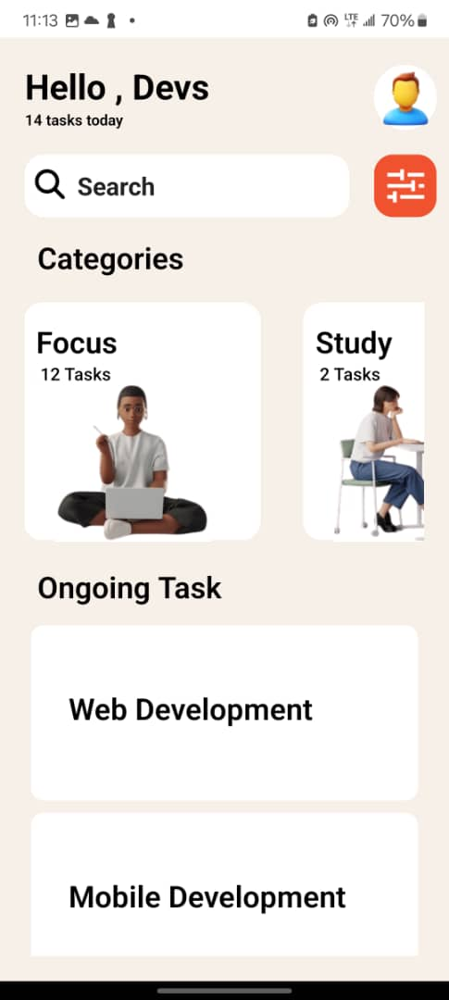
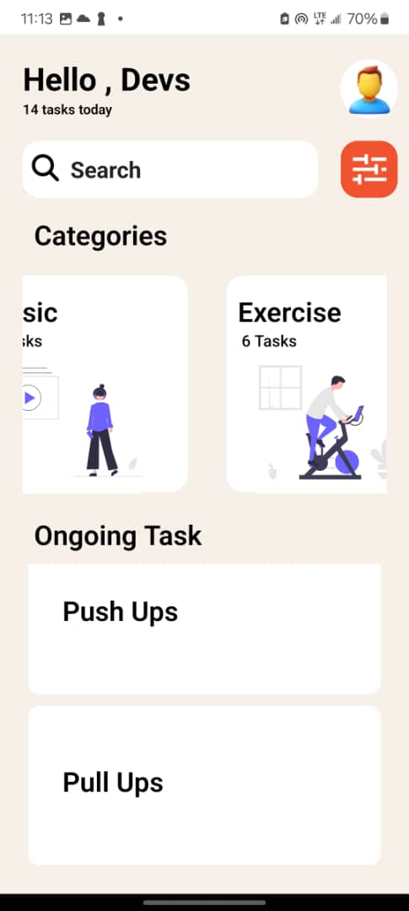

# rn-assignment3-11310591

## Components

### `FlatList`

A component based on `ScrollView` that renders a list of items. It's optimized for large lists of data. Unlike `ScrollViews`, `FlatLists` render what is currently viewable instead of everything all at once.

### `Image`

A component for displaying different types of images, including network images, and images from local disk.

### `ScrollView`

A generic scrolling container that can host multiple components and views.

### `StyleSheet`

A StyleSheet is similar to CSS StyleSheets. It allows you to create and manage styles in a more efficient and optimized manner.

### `Text`

A component for displaying text.

### `TextInput`

A component for inputting text into the app via a keyboard. Like the search bar used in this app.

### `View`

The most fundamental component for building a UI. Similar to a div in html, this is the parent element that is render and every child is also rendered.

### `TouchableNativeFeedback`

A wrapper for making views respond properly to touches. On Android, this component uses native state drawable to display touch feedback.

## Screenshots

Here are some screenshots of the app:

